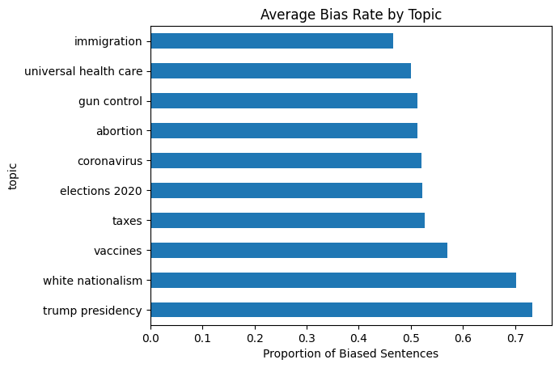
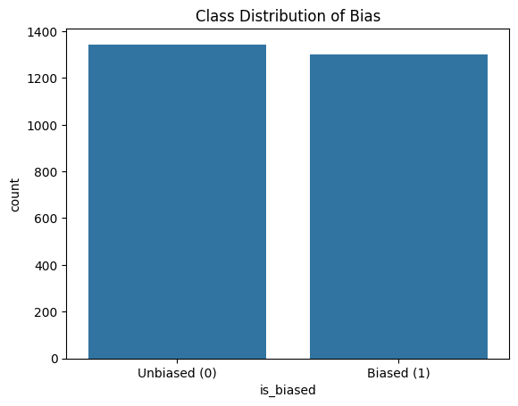
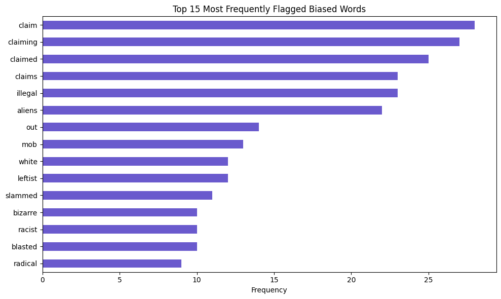
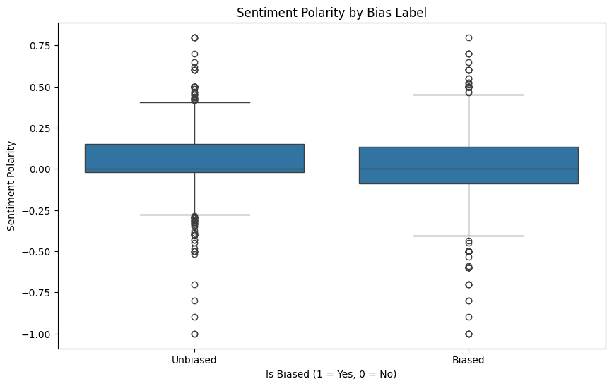
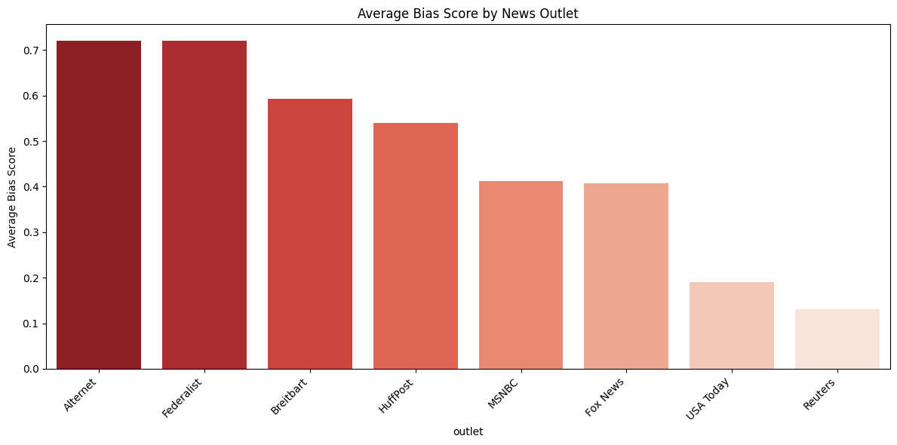
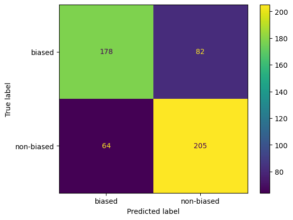
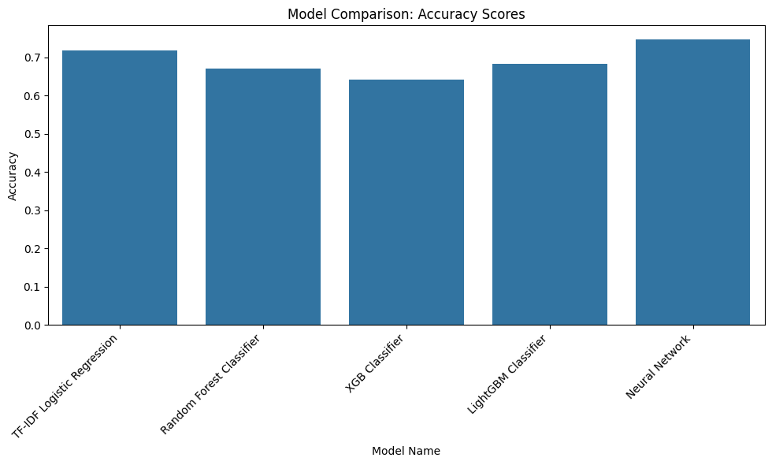

# 🧠 Wikipedia Bias Detection

This project was created for a **Code Jam challenge** focused on assessing potential **bias in Wikipedia articles**. 
Wikipedia strives for neutrality, but since it is publicly editable, implicit bias can still creep into the content. 
This project applies data science and machine learning techniques to detect such bias, ultimately producing a "bias score" for new articles.

---

## 📌 Objective

Build a machine learning pipeline that:
1. **Collects and preprocesses** Wikipedia article data.
2. **Analyzes** the linguistic and sentiment-based patterns in the text.
3. **Trains** a supervised learning model to classify biased vs. unbiased sentences.
4. **Predicts** the bias of new Wikipedia articles via a custom scoring function.

---

## 📂 Project Structure

```bash
├── data/                     # Raw and processed datasets
├── notebooks/                # EDA and experimentation notebooks
├── src/                      # Scripts for data processing, modeling, and prediction
├── models/                   # Trained models
├── outputs/                  # Evaluation results and charts
├── README.md                 # Project overview
├── requirements.txt          # Python dependencies
└── bias_predictor.py         # Script to run bias prediction on new Wikipedia articles
```

## Teammates
Jeel Faldu (jeelfaldu7) she/her
Tirso Paneque he/her

### 🛠️ Industry-Ready Techniques Demonstrated

| Technique                         | Example or Description                                                                 |
|----------------------------------|----------------------------------------------------------------------------------------|
| BERT Fine-Tuning                 | Applied Hugging Face `transformers` for bias classification and tagging               |
| Named Entity Recognition (NER)   | Token-level labeling using BERT-based sequence models                                  |
| Multi-Class Classification       | Fine-grained bias severity detection across multiple classes                           |
| Custom Evaluation Metrics        | Implemented exact and partial match F1 scoring                                         |
| Token Classification             | Used for detecting biased phrases in Wikipedia text                                    |
| Data Annotation & Preprocessing  | Handled multi-span annotations and custom tagging formats                              |
| Shell Scripting for Automation   | Reproducible training via `run_bert_ner*.sh` scripts                                   |
| Modular Codebase                 | Separate directories for classification, tagging, data, and evaluation                 |
| PyTorch + Hugging Face Ecosystem| Standard ML stack for model training and deployment                                    |
| Reproducible ML Environment      | Pinned dependencies in `requirements.txt`                                              |
| Jupyter Notebooks for Evaluation | Used `eval.ipynb` to visualize and interpret model performance                         |
| Error Analysis                   | Identified and analyzed model weaknesses post-inference                                |
| Handling Noisy Labels            | Accounted for ambiguous and overlapping annotations                                    |
| Multi-Span Annotation Handling   | Built support for token-level tags with multiple spans per sentence                    |
| Train/Dev/Test Data Splits       | Clean separation of datasets for unbiased benchmarking                                 |
| Applied NLP for Bias Detection   | End-to-end pipeline from raw Wikipedia articles to bias tag prediction                 |


## 🔄 Workflow
1. Data Collection
Data is sourced from:

Wikipedia API

Potential third-party datasets

Custom web scraping (if needed)

2. Exploratory Data Analysis (EDA)
We investigate:

Term frequency (TF-IDF)

Sentiment distribution

Use of subjective/adjective-heavy language

Named entity usage and patterns

3. Supervised Learning
We classify bias at the sentence level using:

Logistic Regression

Random Forest

BERT-based transformer models (optional for advanced versions)

4. Bias Scoring Function
A function that:

Predicts sentence-level bias

Aggregates results into a normalized bias score for the article

## 🚀 How to Use
Clone the repository
```bash
git clone https://github.com/yourusername/wiki-bias-detector.git
cd wiki-bias-detector
```
Install dependencies
```bash
pip install -r requirements.txt
```
Run a prediction
```bash
python bias_predictor.py --url "https://en.wikipedia.org/wiki/Some_Article"
```
Output
Bias score printed to console

Optionally, sentence-level bias predictions

## 📊 Visualizations

### 1. Bias Scores by Topic


### 2. Bias vs. Article Type Heatmap


### 3. Sentiment Polarity in Biased vs. Unbiased Text


### 4. Top Biased Words


### 5. Model Performance Comparison


### 6. MRCP Concreteness & Imageability


### 7. TF-IDF Feature Distribution



## 🛠️ Tech Stack
Python 3.x

Scikit-learn

NLTK / spaCy

HuggingFace Transformers (optional)

Wikipedia-API

Jupyter for EDA

## ✅ To-Do
 Data collection from Wikipedia API

 EDA of linguistic features

 Sentence-level bias classification

 Bias scoring pipeline

 Model improvement with more labeled data

 Deploy as a web app or API

## 🤝 Conclusions
Our analysis reveals that certain topics consistently attract more biased language than others. Notably, articles related to the Trump presidency and white nationalism show the highest average bias, with over 70% of sentences labeled as biased. This suggests that politically and socially charged subjects tend to include more emotionally loaded or opinionated language.

In contrast, topics like immigration, universal healthcare, and gun control exhibit lower—but still significant—bias levels, typically around 45–50%. This highlights that even seemingly neutral or policy-driven discussions on Wikipedia are not immune to subtle bias.

We also analyzed sentiment polarity across biased and unbiased texts. While both categories generally maintain a neutral tone, biased articles show a wider emotional range—often skewing strongly positive or negative. Unbiased texts, by contrast, reflect a tighter, more balanced distribution. This suggests that sentiment polarity may serve as a useful feature in bias detection, especially when combined with other linguistic markers.

Common biased word patterns include variations of “claim” (e.g., claims, claimed, claiming), as well as emotionally charged terms like “illegal” and “aliens.”

Our findings further show that media sources differ significantly in their bias levels. Outlets like Alternet and The Federalist ranked highest in bias, followed by Breitbart and HuffPost. Interestingly, both Fox News and MSNBC—despite differing political leanings—had similar moderate bias levels. Reuters and USA Today stood out as the most neutral, underscoring the influence of editorial standards on perceived bias.

We trained several machine learning models to predict bias, with the following results (F1 score):

Neural Network: 0.746

TF-IDF + Logistic Regression: 0.718

LightGBM Classifier: 0.682

Random Forest Classifier: 0.671

XGBoost Classifier: 0.642

A case study on a randomized Wikipedia article about the 2024 U.S. presidential election illustrated these patterns. While labeled as “center,”
the article contained emotionally weighted language, showing that even supposedly neutral entries can exhibit subtle bias. Neural network article bias is 64%.  TF-IDF Logistic Regression bias is 54%. 

These results underscore the importance of critical reading and the potential for automated tools to assist in bias
detection and editorial review on open platforms like Wikipedia.


## 📄 License
MIT License – see LICENSE file for details.

## 🙌 Acknowledgments
Thanks to Wikipedia, open-source libraries, and the Code Jam organizers for providing this challenge!
